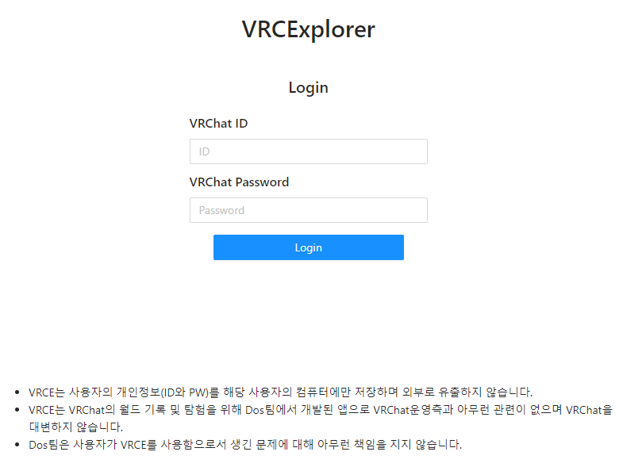

# DOS GANG VRC Explorer

## 실행 사진
### 월드 시트

### 북마크

### VRC

### 파티 및 친구

### 로그인 화면

## 프로젝트 실행

`npm install` 후  
`npm start` 하여 실행한다.

## 관리자 권한모드 이용시
`dos-world-explorer\node_modules\electron\dist\` 경로에 키파일 (`sheetAuth.json`)을 넣고 사용할 것
## 일반유저 모드 이용시에도
`dos-world-explorer\node_modules\electron\dist\` 경로에 키파일 (`vrce-public-api-key.json`)을 넣고 사용할 것

## GITHUB FLOW
1. 현 프로젝트를 [깃허브(링크)](https://github.com/dos-dev-group/dos-world-explorer)에서 자기 개인 계정으로 fork 한다.
2. fork 프로젝트를 로컬에 clone 한다.
3. branch를 따로 판다. branch 이름을 정할 때 내가 개발할 기능을 설명할 수 있는 이름으로 정한다.  
   (ex. 크롤링 조회 기능 개발시: crowling)
4. base 프로젝트에서 개발한 코드를 pull 하고 싶을때 fork한 자기 프로젝트 github페이지에서 pull request를 생성한다.  
   (myProject/브랜치이름 -> baseProject/master 방향으로 PR 생성한다.)
5. breaking change가 담긴 코드면 회의 후 Merge 진행 혹은  
   사소한 (chore) 변경사항이면 바로 Merge를 진행한다.  
   (Github페이지에 Merge 버튼이 있음)

## GITHUB TAG NAME
__feat__: (new feature for the user, not a new feature for build script)  
__fix__: (bug fix for the user, not a fix to a build script)  
__docs__: (changes to the documentation)  
__style__: (formatting, missing semi colons, etc; no production code change)  
__refactor__: (refactoring production code, eg. renaming a variable)  
__test__: (adding missing tests, refactoring tests; no production code change)  
__chore__: (updating grunt tasks etc; no production code change)  
